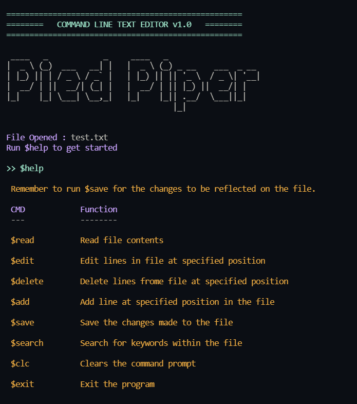
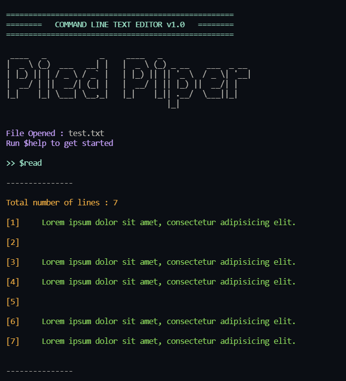

# CommandLine Text Editor

A very basic text editor made in python just for fun :)

Run the python script and pass in the path of the file to be edited. Example:

```bash
python editor.py test.txt
```

## Screenshots

<p float="left">
  
   
</p>
